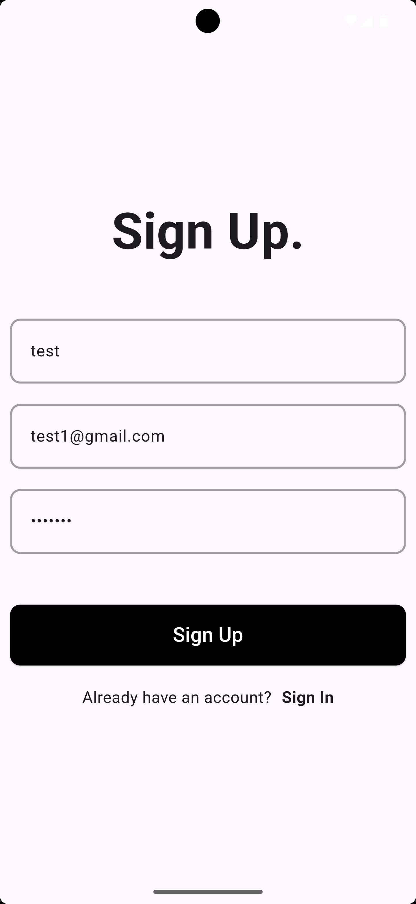
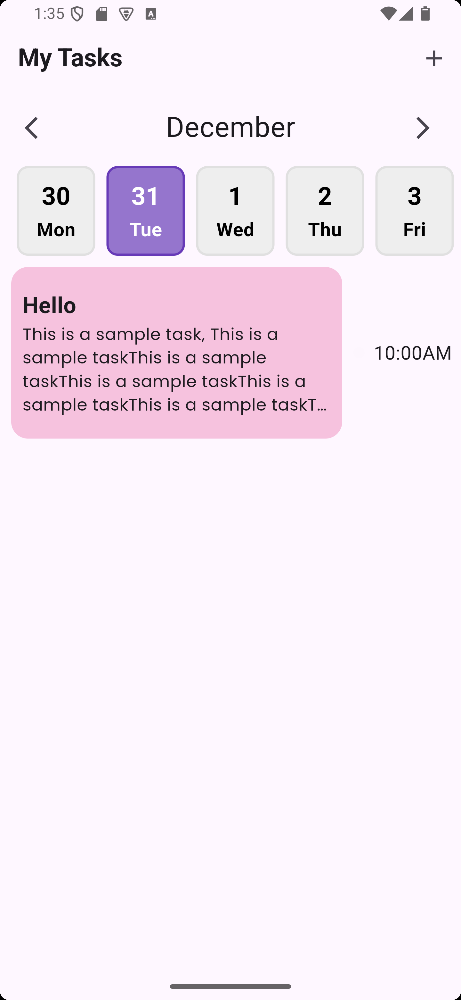

# Task Manager App

- A simple task manager app built with Flutter.

## Features

- Create, read, and delete tasks
- Tasks are stored locally on the device when device is offline.
- Tasks can be synced with a remote server when device is online.

## Getting Started

- Clone the repository: git clone https://github.com/Chinokoo/task-flutter-frontend.git

- Install dependencies: flutter pub get

- Run the app: flutter run

## Screenshots

## API Documentation

#### create task page

- go to create task page by clicking on the floating action button on the home page.

  

#### delete task

- press on the task

  [Insert API documentation for task creation, reading, updating, and deletion]
  Contributing
  Contributions are welcome! If you'd like to contribute to this project, please fork the repository and submit a pull request.

## License

- This project is licensed under the [MIT License](https://opensource.org/licenses/MIT). See LICENSE for details.

## Acknowledgments

- This project was built as part of the Fullstack Nanodegree Program by [Rivan Ranawat](https://github.com/RivaanRanawat).
